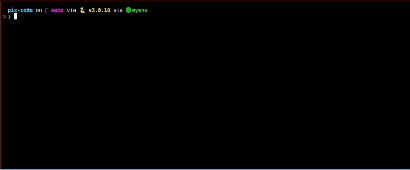
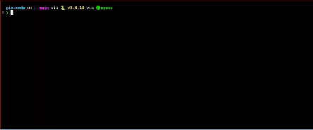

# pix-code


## Files

- `main.py`: The main executable script that coordinates the use of all modules. It sets up the video processing pipeline and handles the execution flow.
- `pix_code_encoder.py`: This script contains the functionality to encode video files. It converts a sequence of images into a video file, applying specified encoding parameters.
- `pix_code_decoder.py`: Complements the encoder by decoding videos back into images or other specified formats.
- `video_pipeline.py`: Manages video uploads using the YouTube API. It authenticates the user, uploads videos, and can list videos from a YouTube channel.

## Setup

1. **Clone the repository:**

   ```bash
   git clone https://github.com/redhotchili0909/dsa_2024.git
   ```

2. **Install dependencies:**

   The scripts require several dependencies, which you can install using:

   ```bash
   pip install -r requirements.txt
   ```

   (Note: You will need to create a `requirements.txt` file based on the libraries used, such as `opencv-python`, `pytube`, etc.)

3. **API Credentials:**

   Before running `video_pipeline.py`, you need to set up your Google API credentials and store them in a `credentials` directory. Refer to the [Google API documentation](https://developers.google.com/youtube/v3/getting-started) for guidance.

## Usage

Each script can be run individually, depending on the task.

### Generating a video
To generate a video from a text file, place the text file into the assets
folder and run main.py. Input the name of the text file and follow the instructions shown in the terminal.



### Decoding a video
Clarify the video you wish to decode




## Reference

Huge thanks to [BK Binary's Video](https://www.youtube.com/watch?v=_w6PCHutmb4) "File Storage on Youtube" for inspiring us to pursue our own implementation.

## License

[MIT](https://choosealicense.com/licenses/mit/)
